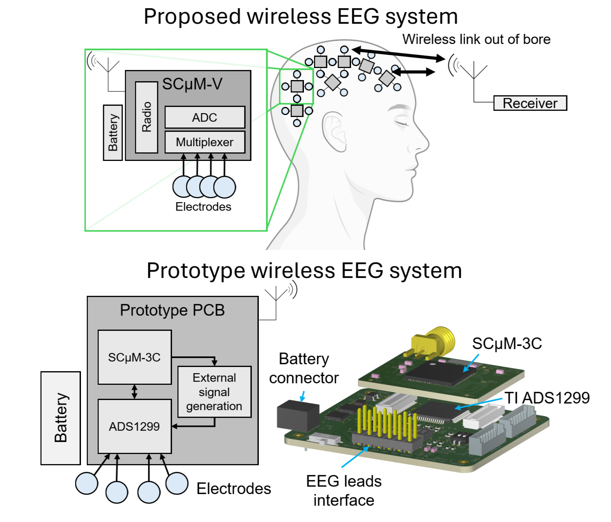
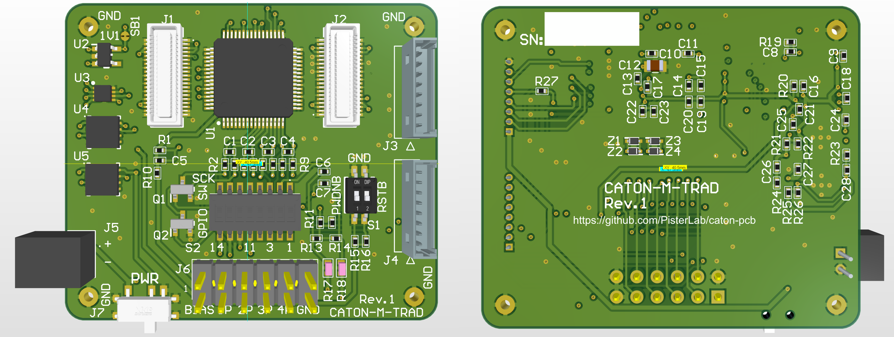
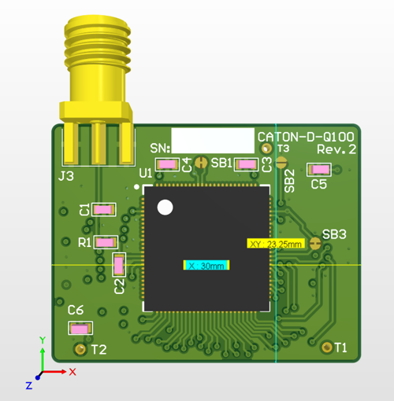

# Caton PCB: A Wireless EEG System for Concurrent TMS-EEG-fMRI

Caton is an open-source, wireless EEG system designed to address the challenges of concurrent TMS-EEG-fMRI studies. By eliminating long wires and large loop areas typical in traditional EEG systems, Caton aims to provide a safer and more effective platform for multimodal brain imaging and stimulation. This repository contains the hardware design files for the Caton project.

This work was published at ISMRM 2025.

## Overview

Concurrent TMS-EEG-fMRI measurements offer improved insights into human brain function, combining high temporal and spatial resolution with causal intervention. However, the long wires in traditional EEG systems pose substantial safety and signal integrity concerns in the MRI environment.

This project introduces a wireless EEG system based on the Single Chip Micro Mote (SCµM). The goal is to enable safer, more effective multimodal brain imaging studies by minimizing wire-induced artifacts and risks. We have developed and validated a prototype system that integrates the SCµM-3C with the Texas Instruments ADS1299 on an MRI-safe PCB. Our results show stable wireless operation from within the MRI bore with minimal disruption from MRI sequences.

## System Architecture

The Caton system is designed to be modular, allowing for flexible development and testing. The main components are the `Caton-M-TRAD` motherboard and compatible daughterboards like the `Caton-D-Q100`.

### Caton-M-TRAD (Motherboard)

`Caton-M-TRAD` is the main motherboard that houses the core circuitry for EEG signal acquisition and power management. It is a traditional PCB that includes:
- The Texas Instruments ADS1299 EEG analog front-end.
- Four power regulators for the different voltage domains:
    - 5V buck-boost for ADS1299 AVDD
    - 1.8V LDO for ADS1299 DVDD
    - 1.8V LDO for SCµM-3C VBAT/VDDIO
    - 1.1V LDO for SCµM-3C VDD
- 2x 20-pin mezzanine connectors for interfacing with daughterboards.
- GPIO jumpers.
- An electrode connector.

### Caton-D-Q100 (Daughterboard)

`Caton-D-Q100` is a daughterboard designed to be mounted on `Caton-M-TRAD`. It contains the SCµM-3C microcontroller in a QFN100 package, which handles wireless data transmission. This modular design allows for rapid testing and iteration of the SCµM-3C unit.

### Caton Multiboard Project

The `caton-multiboard` Altium project integrates the `Caton-M-TRAD` and `Caton-D-Q100` designs into a single, cohesive system.

## Repository Contents

This repository is organized into several Altium projects and corresponding output files:

-   `caton-m-trad/`: Altium project for the main motherboard.
-   `caton-d-q100/`: Altium project for the SCµM-3C daughterboard.
-   `caton-multiboard/`: Altium multiboard project combining the mother and daughterboards.
-   `Project Outputs for caton-m-trad/`: Manufacturing files for `Caton-M-TRAD` (Gerbers, BOM, etc.).
-   `Project Outputs for caton-d-q100/`: Manufacturing files for `Caton-D-Q100`.
-   `docs/`: Documentation, including assembly guides and images.
-   `BSAC-Libs/`, `BWRC-Libs/`, `parts/`: Altium libraries for components used in the designs.

## Building the Hardware

To build the PCBs, you can use the Gerber and NC Drill files located in the `Project Outputs for ...` directories. The Bill of Materials (BOM) is also available in those directories.

Assembly guides with detailed instructions can be found in the `docs` folder:
-   [Caton-M-TRAD Assembly Guide](docs/Caton-M-TRAD-Assembly-Guide.PDF)
-   [Caton-D-Q100 Assembly Guide](docs/caton-d-q100-assembly.pdf)

## Citation

If you use this work, please cite the following publication:

Lovell, D., Maravilla, J., Lin, Y.C., Liu, C., Lustig, M., Niknejad, A.M., & Pister, K.S.J. (2025). *WIRELESS EEG SYSTEM FOR CONCURRENT TMS-EEG-fMRI*. International Society for Magnetic Resonance in Medicine (ISMRM).

And the open-source hardware:

Lovell D. Caton PCB: Prototype Wireless EEG System (Version 0.2.0) [Computer software]. GitHub 2025. doi:10.5281/zenodo.1234567.

## Acknowledgements

The authors acknowledge the support of the NIH under award number R01MH127104.

## License

This project is licensed under the BSD 3-Clause License. See the [LICENSE](LICENSE) file for details.
 
